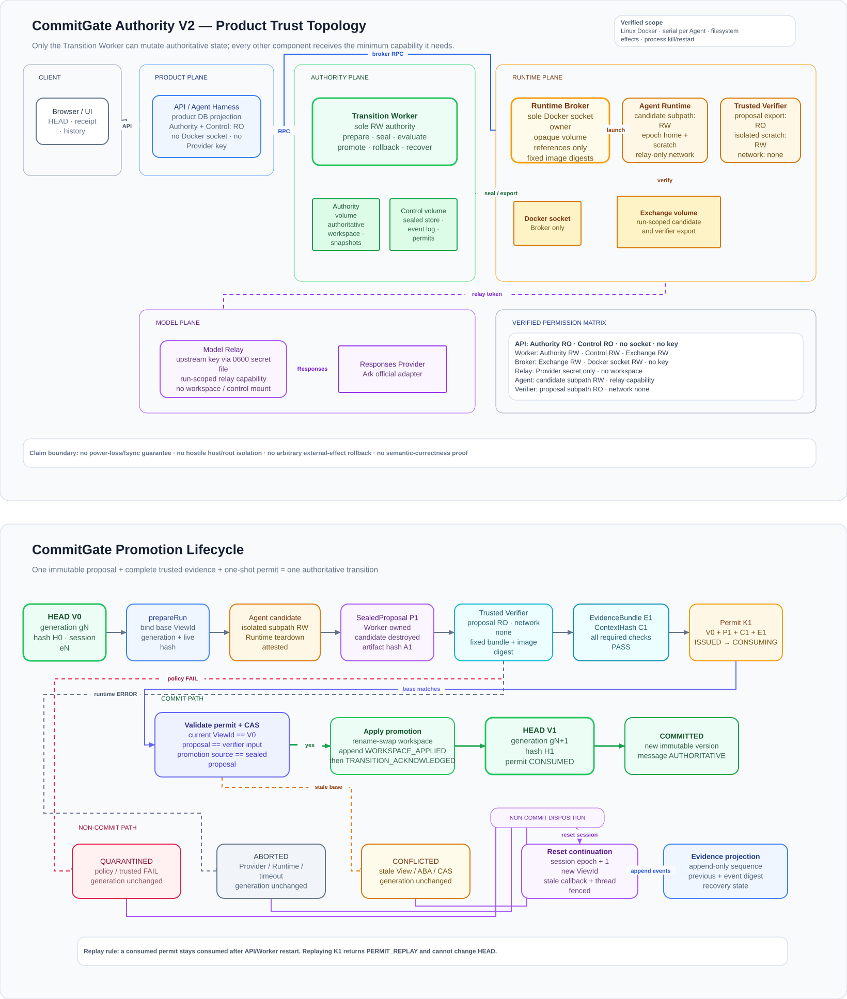

# CommitGate Authority

CommitGate is evidence-bound state-promotion middleware for coding agents. An
agent may propose filesystem changes, but it cannot directly decide what the
next turn will treat as authoritative state.

```text
HEAD / StateView
→ isolated candidate
→ sealed proposal
→ trusted verifier
→ evidence bundle
→ one-shot promotion permit
→ Transition Worker compare-and-swap
→ next authoritative HEAD
```



Editable two-page diagram: [`docs/commitgate-authority-v2.drawio`](docs/commitgate-authority-v2.drawio).

## Why this exists

A successful model or container run does not prove that its filesystem effects
are admissible. CommitGate separates proposal generation from state authority:

- the **Transition Worker** is the only component with read-write access to the
  authoritative workspace and control store;
- the **Runtime Broker** is the only component with access to the Docker socket;
- the **Model Relay** is the only component that receives the upstream provider
  key;
- the **Verifier** receives a read-only export of the sealed proposal, an
  isolated scratch directory, fixed trusted checks, and no network;
- the product API stores a projection and mounts authority/control read-only.

## Protocol

A promotion is accepted only when:

```text
sealedProposalHash == verifierInputHash == promotionSourceHash
AND required trusted evidence is complete
AND every required check is PASS
AND the evaluation-context digest is unchanged
AND the current StateView matches the permit base view
AND the permit is consumed exactly once
```

Terminal decisions are `COMMITTED`, `QUARANTINED`, `CONFLICTED`, and `ABORTED`.
Commit and rollback advance the workspace generation. A non-commit keeps the
workspace generation unchanged while advancing the session epoch and fencing
stale callbacks or continuations.

## Quick start

Requirements: Node.js 22+, Docker Engine with Compose, and a Responses-compatible
model endpoint.

```bash
cp .env.local.example .env.local
chmod 600 .env.local
# Set MODEL_ID and MODEL_API_KEY in .env.local
npm ci
npm run demo
```

Useful commands:

```bash
npm run demo:status
npm run demo:logs
npm run demo:down
npm run demo:reset
```

## Validation

```bash
npm run check
npm run eval:protocol
npm run eval:adversarial
npm run eval:recovery
npm run eval:container
npm run eval:p1-product
npm run eval:filesystem:linux
npm run demo:smoke
npm run check:secrets
```

## Scope

The verified design target is Linux Docker, serial transitions per agent,
workspace filesystem effects, and process kill/restart recovery. It does not
claim power-loss durability, hostile host/root isolation, arbitrary external
API rollback, complete information-flow confinement, or semantic correctness.

See [`docs/ARCHITECTURE.md`](docs/ARCHITECTURE.md),
[`docs/DEPLOYMENT.md`](docs/DEPLOYMENT.md), and
[`docs/LIMITATIONS.md`](docs/LIMITATIONS.md).

## License

MIT
