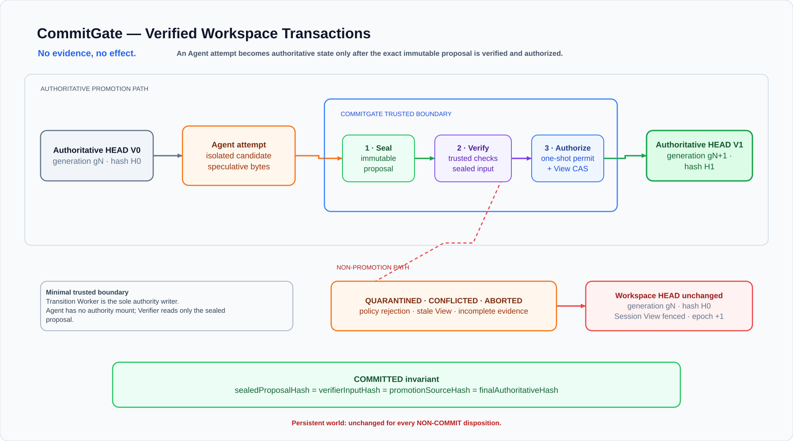

# CommitGate — Verified Workspace Transactions for AI Agents

> **No evidence, no effect.** Agent execution is speculative; persistence is
> privileged.

As a platform user, create an Agent exactly as before. Every
filesystem-changing turn is automatically executed as an isolated proposal and
must pass CommitGate before it becomes persistent state. No per-Agent policy
setup or Agent prompt integration is required.

CommitGate is middleware for coding Agents that separates speculative execution
from authoritative persistence. A coding Agent can produce a proposal, but it
cannot directly decide what the next turn will treat as the real workspace:

> **CommitGate uses a one-shot, evidence-bound capability to move one immutable
> Agent proposal into the next authoritative workspace view.**

```text
Authoritative HEAD (View V0 / generation g0)
  -> isolated Agent candidate
  -> gate-owned SealedProposal P1
  -> verifier input materialized from P1
  -> EvaluationContextHash + trusted EvidenceBundle
  -> one-shot PromotionPermit K1
  -> compare-and-swap on V0
  -> authoritative HEAD (View V1 / generation g1)
```



Editable source: [`docs/commitgate-architecture.drawio`](docs/commitgate-architecture.drawio).

This is intentionally described as a **pre-effect admission transaction for
filesystem state**, not as a distributed ACID transaction, a complete egress
sandbox, or proof that the Agent is semantically correct.

## Reviewer quick start

1. Configure the Provider and install dependencies:

```bash
cp .env.local.example .env.local
chmod 600 .env.local
# Fill MODEL_ID and MODEL_API_KEY. The demo uses deployment-protected@2.
npm ci
```

2. Start the complete product. Keep that terminal open; in a second terminal,
   copy the local access token without printing it:

```bash
npm run demo
# Run this in a second terminal while the demo remains active:
npm run demo:auth
```

3. Open <http://127.0.0.1:3000>, create a new Agent with the normal Create
   Agent form, and send these two tasks through the Playground:

```text
Create services/checkout/config.json with a small checkout configuration and
create result.txt containing COMMITGATE_OK.

Change infra/production.yaml to replicas: 0 and create rejected-marker.txt.
```

The first run must be `COMMITTED` with `gN -> gN+1`. The second must be
`QUARANTINED` with the workspace HEAD unchanged. Expand **Full sanitized
receipt** and choose **Attempt replay** to observe `409 PERMIT_REPLAY`.

Every newly created Agent receives this gate automatically. The Worker owns the
selected policy pack; API and Agent requests cannot submit arbitrary policy
rules or protected paths.

A GitHub checkout derives its source identity from Git. A release archive has
no `.git` directory and instead carries `RELEASE_PROVENANCE.json`, an exhaustive
path/mode/SHA-256 inventory generated by `npm run release:provenance`. `npm run
demo` validates that inventory automatically and fails closed on a missing,
extra or modified source file; no archive-specific environment flag is needed.

The repository's immutable review snapshot is under `evidence/current/`.
Commands write fresh working reports under `eval/` and never overwrite that
snapshot. Large trace/video artifacts are distributed as SHA-256-bound release
assets rather than hidden inside the source history.

To keep two Provider credentials separate, create an ignored owner-only file
such as `.env.openrouter.local` and launch with
`COMMITGATE_ENV_FILE=.env.openrouter.local npm run demo`. The default remains
`.env.local`; neither filename nor credential value is recorded in receipts.

## Focused integration

The implementation is based on Starter Kit revision
`8d0bd4f14ad1e453d984149aebcdd0bcb4f74178`. It preserves the existing Agent
CRUD, Playground, asynchronous Runs and Codex CLI lifecycle, and integrates one
coherent middleware layer at the existing seams:

| Existing seam | Focused change |
|---|---|
| `AgentService` and Runner | route filesystem-changing turns through admission |
| Fastify API | expose sanitized receipts, proof, replay and rollback |
| Runtime | delegate containers to the constrained Runtime Broker |
| Workspace transition | delegate authority to the Transition Worker |
| Receipt UI | explain `HEAD -> PROPOSAL -> PERMIT -> HEAD` and non-effect |

Review the exact baseline diff without counting generated evidence as product
implementation:

```bash
git diff --stat 8d0bd4f14ad1e453d984149aebcdd0bcb4f74178..HEAD -- \
  apps/server/src apps/web/src docker-compose.yml package.json
```

### Policy extension contract

The Worker, not an API caller, owns the policy profile and trusted-check set.
The supplied contracts are `workspace-default@1` and
`deployment-protected@2`. An operator extends the gate by adding a versioned
Worker profile, increasing its version, and regenerating policy-bound evidence;
an Agent or per-Agent UI cannot inject arbitrary protected paths. Omitting a
caller-writable policy editor is therefore an authorization boundary rather
than an unfinished UI feature.

## Persistence invariants

CommitGate exposes two mechanically checkable outcomes rather than asking a
caller to assert that a run was safe:

```text
COMMITTED:
  sealedProposalHash
  == verifierInputHash
  == promotionSourceHash
  == finalAuthoritativeHash

NON-COMMIT (QUARANTINED | CONFLICTED | ABORTED):
  authoritativeAfterHash == authoritativeBeforeHash
```

The receipt API derives an `EffectDispositionProof` from authoritative hashes:

```ts
interface EffectDispositionProof {
  candidateChanged: boolean; // compatibility projection of candidateObservation
  candidateObservation: "changed" | "unchanged" | "unobserved";
  admissionBaseHash: string;
  authoritativeBeforeHash: string;
  authoritativeAfterHash: string;
  authoritativeChanged: boolean;
  sealedProposalHash: string | null;
  verifierInputHash: string | null;
  promotionSourceHash: string | null;
  finalAuthoritativeHash: string;
  invariant: "PROMOTED_EXACT_PROPOSAL" | "NO_PERSISTENT_EFFECT";
  invariantSatisfied: boolean;
}
```

For `CONFLICTED`, `authoritativeBeforeHash` is the disposition-time HEAD after
the competing transition, while `admissionBaseHash` remains the stale proposal
base. The proof therefore demonstrates that rejecting the stale proposal made
no *additional* persistent change; it does not pretend that the workspace never
changed for another authorized reason.

## Evidence status

The release uses two Git identities. `SOURCE_REVISION` is the newest commit that
changed the frozen source surface (product code, evaluators, documentation,
trusted checks, or `eval/fixtures`). `EVIDENCE_REVISION` is a later commit that
packages generated reports. Evidence-only changes under `eval/` do not advance
`sourceRevision` or `sourceTreeHash`; provenance also records the capture-time
`headRevision`. A report never claims the hash of the commit that contains
itself, which avoids evidence-report self-reference.

An active claim becomes `verified` only after the expected report is regenerated
from one frozen `SOURCE_REVISION` and records the matching source-tree hash and
applicable image identities. Older clean-clone captures, including an Ark
capture through the generic Responses-compatible Provider boundary, are
historical evidence only for the revision embedded in those reports. Provider
identity is provenance, not a scoring category, and historical reports must not
be combined with the active release identity.

The old repository `100/100` was an internal rubric projection, not an organizer
score. It is historical and is not carried into the active evidence set. The
current `npm run evidence:checklist` reports only `verified`, `failed`, and
`unverified`; it assigns no numeric score. Worker authority is the default
product implementation. The narrated three-minute submission video remains
`unverified` until the user records and validates it.

When regenerated, the exact test count, command identity, and result are read
from `eval/evidence/check-report.json`; prose, source files, or an old report do
not substitute for a successful report bound to the frozen release identity.

Provider evidence is transport-neutral:

- the product uses a **Responses-compatible Provider** boundary, with Ark and
  OpenRouter adapters supplied in this repository;
- a regenerated real browser capture identifies the Provider it actually used;
- new reports expose `providerE2EVerified` and preserve Provider identity as
  provenance, not as a source of points;
- legacy `officialProviderE2E` and `competitionVerified` fields are accepted
  only when reading historical reports and never affect the checklist;
- a Provider/browser claim must come from matching real Provider and Playwright
  reports, not from API, FakeRunner, or deterministic tests alone.

See [`docs/LIMITATIONS.md`](docs/LIMITATIONS.md) for the exact claim boundary.

## Core protocol

### Authoritative state view

Every transition is based on a `StateViewRef`, not on a workspace hash alone.
The view binds:

- current head version and monotonically increasing generation;
- versioned, platform-managed, and live-state digests;
- session epoch;
- Agent configuration and policy versions.

Commit, rollback, and Agent-configuration/platform regeneration advance the
generation. A non-commit keeps the workspace generation but advances the
session epoch, so it still creates a different View and fences an old
observation after an `H0 -> H1 -> H0` ABA cycle. Deleting an Agent archives its
workspace and removes the product record; this tree has no restore transition
whose generation semantics could be claimed. The UI exposes the current
generation, View ID, head version, live-state digest, and session epoch.

In the production Worker path, callers submit an operation and an expected
base View; they do not submit the next `StateViewRef`. The Worker derives the
resulting generation, hashes, head and `ViewId` from its authoritative bytes
and append-only parent event. Product-database fields are projections of that
Worker-derived View, never inputs that can overwrite it.

### Immutable proposal

After the Agent Runtime has terminated, CommitGate imports the candidate into a
gate-owned, content-addressed `SealedProposal`. The original candidate is no
longer a verifier or promotion source. The same proposal identity must bind:

```text
sealedProposalHash == verifierInputHash == promotionSourceHash
```

The proposal also records the base View ID, manifest/diff digests, and Runtime
teardown evidence. A rejected proposal payload is destroyed; retained evidence
is sanitized metadata rather than a browsable copy of the rejected source.

The default production path transfers the candidate into the Transition Worker.
Only the Worker container receives read-write Authority and Control mounts;
API mounts both read-only, and Broker/Relay mount neither.
The sealed property is still a protocol property rather than an OS immutable
bit, but an API-process write bypass is now closed by the Docker mount boundary.
The in-process `WorkspaceTransitionWriter` remains only for tests/development.
Worker, Broker, and Runtime artifacts intentionally share artifact-owner UID
`10001` so Broker can hash owner-only `0500/0600` exports. Worker/Broker
separation is provided by disjoint mounts and socket groups, not different UIDs.

Exchange references are not caller-selected paths. The Worker derives the exact
run-scoped names `candidate-${runId}` and `verify-${runId}`, binds them to the
admitted Agent/run/lease/session (and the verifier export to its proposal), and
rejects raw paths or another run's subpath. Candidate and verifier bindings are
write-once. Sealing consumes and tombstones the candidate binding; exporting
cannot overwrite an existing or foreign verifier binding. Recreating an old
directory name therefore does not recreate its authority.

The Broker also persists a monotonic lifecycle ledger in its Session volume:

```text
AGENT_STARTED -> AGENT_CLOSED -> VERIFIER_STARTED -> ALL_CLOSED
```

The ledger is keyed by the exact `runId + agentId + runLeaseId + sessionEpoch`.
Unknown or rebound runs are rejected, stages never move backwards, and terminal
tombstones survive a Broker process restart. Once Agent or all Runtime mounts
have been attested closed, the same binding cannot launch them again.

### Broker evidence authenticity

The production Broker and Worker share a per-start HMAC-SHA256 attestation key
through a `0600` secret file. The API, Relay, Agent, and Verifier do not receive
that key. The Broker authenticates two kinds of bounded evidence:

- Runtime teardown/reconciliation binds run, Agent, lease, session, scope and
  the negative container/mount observation;
- verifier evidence binds those run fields plus proposal ID, verifier-input
  hash, check spec/results/coverage, and the frozen bundle/image/config/resource/
  source pins.

The Worker verifies the MAC and then independently compares every binding to its
own admitted transition and frozen context. A caller-supplied `PASS`, fabricated
teardown object, or recomputed JSON digest is not evidence in the production
path. This HMAC establishes origin relative to the shared Broker/Worker secret;
it does not prove that a compromised Broker or Worker told the truth, resist a
host/root adversary, or provide third-party attestation. It is distinct from
both the Relay's model-access bearer and the Worker's Ed25519 terminal-receipt
signature.

### Evidence-bound one-shot permit

Trusted evidence is bound to an `EvaluationContextHash` covering the base view,
proposal, manifest schema, policy, trusted-check bundle/spec, verifier image and
configuration, resource policy, and source revision. A permit can be consumed
only once and only while its expected base View is still current.

`sourceRevision` is structural context, not automatically Git-attested
provenance. Development and unit-test processes may use the literal
`unverified`, but the production API, Runtime Broker, and Transition Worker now
fail startup unless `COMMITGATE_SOURCE_REVISION` is the same frozen, full
40-hex source commit. Final reports still independently bind the commit to the
clean source-tree hash and image identities; merely supplying an environment
variable is not provenance proof.

```text
COMMIT iff
  sealed proposal == verifier input == promotion source
  AND required trusted evidence is complete
  AND every required check is PASS
  AND EvaluationContextHash remains unchanged
  AND current ViewId == permit.baseViewId
  AND permit atomically reaches CONSUMED
```

A timeout, verifier error, missing or malformed evidence is `ABORTED`, not a
policy rejection. `QUARANTINED` is reserved for a trusted verdict that the
proposal violated policy or failed a required check.

Permit issuance requires complete evidence, all required checks passing, and a
verifier-input hash equal to the sealed proposal manifest. Claiming creates a
durable claim, and the transaction invokes the capability's one-shot consume
operation after View CAS and immediately before rename-swap. Reusing either the
same capability object or its persisted permit is rejected. A separate
one-shot `RollbackPermit` binds a rollback target snapshot, expected head, and
base hash; rollback verifies the snapshot before copying **and** re-hashes the
transaction-owned staging bytes before swap to close the copy-time TOCTOU
window.

| Decision | Meaning | Workspace |
| --- | --- | --- |
| `COMMITTED` | evidence passed and the one-shot permit was consumed | advances to a new View/generation |
| `QUARANTINED` | trusted policy/check evidence rejected the proposal | authoritative HEAD unchanged; artifact destroyed |
| `CONFLICTED` | the expected base View is no longer current | authoritative HEAD unchanged |
| `ABORTED` | Runtime, verifier, evidence, cancellation, or transaction could not produce a trusted verdict | authoritative HEAD unchanged |

## Message and continuation authority

Messages are explicitly classified as:

```text
INPUT | PROVISIONAL | AUTHORITATIVE | REJECTED | SUPERSEDED
```

Agent output is provisional until the gate reaches a terminal decision.
Committed output is attached to the next View; non-committed output is retained
for audit as rejected and is excluded from subsequent Agent context. A
non-commit, rollback, recovery, or configuration change increments the session
epoch and forces fresh reconciliation against the current authoritative View.
Old callbacks must carry the active run lease, base View, and session epoch or
be recorded as stale without mutating head, run, or message state.

## Verifier boundary

The verifier is credential-free and receives:

- a read-only proposal projection;
- a content-addressed, platform-owned trusted-check bundle;
- an isolated writable scratch directory;
- no Provider key, Codex home, Docker socket, control root, or persistent
  workspace mount;
- no routable network (`--network none` on the verified Docker path);
- dropped capabilities and bounded CPU, memory, PIDs, time, and output.

Policy binds a typed check specification (`id`, `runner`, `entrypoint`, `args`,
timeout, and scratch budget) to a platform-owned, content-addressed
`TrustedCheckBundle`; the entrypoint must exist as a regular file in that
sealed bundle. Candidate-provided `package.json`, PATH resolution, or test
wrapper is therefore not acceptance authority. This is not an ID-only registry,
and the implementation does not forbid the platform-owned executable itself
from using a shebang or shell. Every check gets an independent scratch and the
whole verifier run shares its time/output budget. Sealed trusted-bundle payloads
are content-addressed but currently have no retention/pruning job, so long-lived
deployments must monitor that control-root storage.

`--network none` is a claim about the verifier container only. It is not a claim
that the whole product has no egress: a real model Runtime necessarily reaches
a Model Provider, and complete host-side information-flow mediation is outside
the P0 guarantee.

## Provider configuration

The generic provider configuration takes precedence:

```dotenv
MODEL_PROVIDER=ark                    # or openrouter
MODEL_BASE_URL=https://PROVIDER/v1
MODEL_ID=MODEL_ID
MODEL_API_KEY=LOCAL_SECRET
MODEL_WIRE_API=responses
```

Legacy `ARK_API_KEY`, `ARK_MODEL`, and `ARK_BASE_URL` remain compatible when the
selected Provider is Ark. During development a key belongs only in Git-ignored local
configuration. In the production Relay profile the upstream key belongs only
to the Relay environment; the API environment must omit it. Keys must not enter
source, Git history, receipt JSON, logs, screenshots, or evidence reports. This
tree does **not** implement automatic Provider fallback: `retryOfRunId` is a
reserved run-record field and is currently initialized to `null`. The
release process configures one Provider. A manual Provider change requires
a service restart plus an explicit Agent configuration/session reset and a new
run; an in-place model switch during a side-effecting attempt is not supported.

The release launcher always runs the bundled minimal Model Relay.
The Agent receives a short-lived HMAC bearer capability whose signed payload
contains run, Agent, and session-epoch provenance; the relay verifies the
signature, expiry, active-token registry, and configured model on every
request, while the upstream Provider key remains in the relay process. The
Responses request has no second, independently authenticated run/Agent/session
identity, so possession of the bearer token is the actual request authority.
A capability may serve the multiple Responses calls of one Agent loop. Runtime
teardown revokes its nonce and records revocation in teardown evidence; a
failed activation/revocation fails closed. The active/revoked registry is
in-memory, so a relay restart invalidates all outstanding active capabilities
and interrupts those runs rather than preserving their availability. The other
crash direction is an availability/security window: if the API dies after
activation and loses the bearer before revoking it, the Relay can keep that
already-activated bearer valid until its TTL. Revocation blocks later Relay
requests but cannot cancel an upstream request that was already forwarded. The
Agent joins only the internal Agent–Relay network, while the Relay alone also
joins the Provider-egress network. This boundary is created by the unified
`docker-compose.yml` through `npm run demo`; old split Relay/Worker Compose files
are historical or evaluator scaffolds and are not supported product launchers.
`MODEL_ACCESS_MODE`, Relay URLs, network identity, and the generated capability
secret are launcher-owned production settings rather than a manual partial-stack
recipe.

Production configuration fails closed when CommitGate is enabled without the
container Runtime, relay mode, an API-reachable relay admin endpoint, a
dedicated internal Agent network, or when the API process itself is given the
upstream Provider key. Before each run, the Runtime code also inspects the
configured Docker network and requires its actual `Internal` property to be
true. Direct Provider access remains development/test compatibility only. This
is request-path mediation for the Responses endpoint, not a general host-side
information-flow guarantee. A regenerated Provider/Playwright report can verify
the Relay E2E only for its recorded Provider, source, and image identities; it
does not expand this narrow boundary into a complete no-egress claim.

The Relay records `resolvedModel` only when the gateway response exposes a
parseable model identity consistently; otherwise receipts correctly retain
`null` rather than copying the requested model.

The Runtime places the five default root-level ignored names on bounded tmpfs
mounts. Independently, Manifest v2 treats those names as ignored at **any path
segment**, charges every ignored inode and byte to finite candidate quotas, and
omits them from Proposal, Verifier input, and promotion. The production Linux
Worker also rejects symlinks, hardlinks, special/sparse files, case-fold and
Unicode-normalization collisions, unexpected ownership/mode, xattrs, ACLs,
and cross-filesystem swaps. The single-active-run exchange is a shared tmpfs
with kernel byte and inode ceilings, so even a nested ignored tree has a hard
aggregate Runtime bound. Manifest limits remain the finer-grained admission
fence; the tmpfs ceiling is intentionally stack-wide rather than a reusable
multi-Agent quota mechanism.

The Worker manifest walk also has a monotonic wall-clock budget (30 seconds by
default) in addition to entry and byte limits. Exceeding it fails admission
with `CANDIDATE_SCAN_TIME_BUDGET_EXCEEDED`; ignored paths consume the same scan
budget even though their bytes never enter the proposal.

## Running the current checks

Requirements: Node.js 22+, npm 10+, and Docker for protected Runtime/verifier
checks.

```bash
npm ci
npm run check
npm run eval:protocol
npm run eval:adversarial
npm run eval:container
npm run eval:recovery
npm run eval:recovery:docker
npm run eval:performance
npm run eval:filesystem:linux
npm run audit:authority
npm run audit:architecture
npm run demo:preflight
npm run demo:smoke
npm run eval:p1-product
```

After those credential-independent checks, run the real Provider/browser path
**before** deriving receipt and invariant reports:

```bash
set -a; source .env.local; set +a
npm run eval:provider -- --provider "${MODEL_PROVIDER:-ark}"
npm run eval:browser:clean-clone -- --provider "${MODEL_PROVIDER:-ark}"
npm run receipt:verify
npm run eval:invariants
npm run check:secrets
npm run audit:documentation
npm run audit:clean-clone
npm run demo:verify-video -- \
  --file /ABSOLUTE/PATH/demo.mp4 \
  --manual-narration-review \
  --manual-agent-run-review \
  --manual-secret-review
npm run audit:source-delivery -- \
  --reviewer-login REVIEWER_GITHUB_LOGIN
npm run evidence:checklist
npm run audit:release
```

`demo:smoke` starts the real stack and regenerates the live topology report;
`eval:p1-product` must run immediately afterwards and consume that report.
Running `audit:topology` against a stopped stack is a diagnostic `unverified`,
not release evidence. This order is part of the evidence contract: the browser run emits the finite
terminal proof set; `receipt:verify` re-verifies its bytes; `eval:invariants`
consumes that verification; the checklist and release audit run last.

`eval:invariants` evaluates one fixed registry of ten effect-capable negative
fixtures. Three browser fixtures carry observed raw before/after hashes; the
three CAS and four accepted-cancellation fixtures are explicitly
`assertion-backed` by named, revision-bound Vitest cases. Assertion-backed
records leave both raw-hash fields `null`; they are never relabelled as observed
hashes. Removing any registry fixture or its named evidence fails the release
contract.

`eval:performance` is a **Transition Worker local-filesystem protocol
microbenchmark**, not a product Verifier benchmark. For 4 KiB, 256 KiB, and
1 MiB fixtures it runs 30 iterations of seal, export, a manifest plus
fixed-file deterministic probe, permit, and promotion. The recorded
`deterministicProbeMs` does not include Runtime Broker RPC, a Verifier
container, the trusted-check bundle process, model inference, or network
latency. Consequently the report must not be presented as Verifier latency or
end-to-end Agent Run latency.

`demo:verify-video` mechanically checks duration, resolution, and audio/video
streams. After watching the complete video, the submitter uses three explicit
flags to record review of narration, a visibly executed real Agent Run, and
sensitive information. The `--manual-secret-review` flag records the human
sensitive-information check required for the official submission. This
produces `officialSubmissionReady=true`. An
external reviewer may additionally create an Ed25519-signed envelope with
`npm run demo:sign-review`; that upgrades `externalReviewVerified` but is
optional and does not block the official submission result. If an external
review is claimed, `audit:release` re-verifies its video hash, reviewer/key
anchor and signature.

`audit:source-delivery` separately checks that the sanitized mirror contains
the exact product bytes from the frozen source, remains clean, passes its
vocabulary/secret scans, and either supports anonymous reads at the matching
successful-CI revision or is accompanied by a byte-for-byte `git archive` plus
`.sha256` file. For the public mirror, the
audit disables Git credential helpers and verifies anonymous `main` access;
repository metadata alone does not prove anonymous clone access. Set
`COMMITGATE_SOURCE_ARCHIVE` (and keep the default `<archive>.sha256` companion)
to use the archive delivery path.

The default product launcher is now:

```bash
npm run demo
```

After startup, copy the temporary API credential without printing it:

```bash
npm run demo:auth
```

`demo:down` and `demo:reset` remove runtime secret files and clear the clipboard
only if it still contains that Demo credential.

It starts the Model Relay, Unix RPC Runtime Broker and production API. The API
uses `RUNTIME_PROVIDER=broker`; only the Broker launches Agent containers, and
only the Relay receives the upstream Provider key. These credential-independent
commands do not prove a real Provider or browser path; use the ordered freeze
sequence above for that evidence.

Only reports bound to the same current revision/source-tree hash and Runtime /
Verifier image identity can be combined into a release evidence set. The exact three-minute
browser flow is in [`docs/DEMO_3_MINUTES.md`](docs/DEMO_3_MINUTES.md).

The expected active evidence paths are listed below. Their existence does not
mean `verified`: each must be regenerated after `SOURCE_REVISION` is frozen,
report success rather than a skipped/failed state, and match the same source
tree and required image identities. Until then, the corresponding claim is
`unverified` and any older file belongs under `eval/history/<revision>/`.

```text
eval/protocol-report.json
eval/adversarial-report.json
eval/container-report.json
eval/recovery-report.json
eval/authority-report.json
eval/evidence/check-report.json
eval/evidence/p1-product-report.json
eval/evidence/linux-filesystem-report.json
eval/evidence/topology-report.json
eval/evidence/demo-smoke-report.json
eval/provider-<provider>-report.json
eval/browser-clean-clone-report.json
eval/independent-audit-report.json
eval/evidence/invariants-report.json
eval/evidence/docker-recovery-report.json
eval/evidence/terminal-receipt-proof-bundles.json
eval/evidence/receipt-verification-report.json
eval/evidence/performance-report.json
eval/evidence/documentation-review.json
eval/evidence/architecture-report.json
eval/evidence/source-delivery-report.json
eval/evidence/secret-report.json
eval/evidence/demo-video-report.json
eval/evidence/demo-video-review-attestation.json
eval/evidence/evidence-checklist-report.json
eval/evidence/release-audit-report.json
```

`eval/score-report.json`, `eval/score-report.md`, and `eval/real-report.json`
belong to historical report contracts. They are not inputs to the active
evidence checklist.

An executable Playwright/Chromium path is checked in behind `npm run
eval:browser:clean-clone`: it requires a committed clean source and real
Provider credentials, creates a no-hardlink clone, runs `npm ci`/build/image
builds, starts the Relay and protected product, drives browser create/commit/
quarantine/Provider-failure/fresh-follow-up/rollback, checks replay of the
consumed permit, and hashes trace/video/screenshot/report artifacts. Missing
prerequisites exit `2` with `unverified`; a scenario failure reports `failed`.
A release browser report is accepted only when it contains **12/12** verified
steps, including matching hashes for trace, automation video, screenshot,
terminal proof set, and driver report, all bound to the frozen source. Its
Provider is recorded explicitly. `npm run audit:clean-clone` is the separate,
team-authored no-hardlink/read-only-source replay; it is not an external audit
and is not a substitute for browser evidence.

## Product APIs and UI

Existing run polling remains:

```text
GET /api/runs/:id
```

CommitGate exposes sanitized decision details and logical version history:

```text
GET  /api/runs/:id/commitgate
GET  /api/runs/:id/commitgate/proof
POST /api/runs/:id/commitgate/promotion-attempts
     { "permitId": "...", "expectedViewId": "..." }
GET  /api/agents/:id/versions?limit=20&beforeSequence=N
POST /api/agents/:id/rollbacks
     {
       "targetVersionId": "...",
       "expectedHeadVersionId": "...",
       "expectedViewId": "...",
       "expectedGeneration": 12
     }
```

The React UI shows:

- authoritative `HEAD / generation / View / session`;
- `HEAD -> PROPOSAL -> PERMIT -> HEAD` transition state;
- `Candidate world` versus `Persistent world`, with the derived
  `EffectDispositionProof` and invariant result;
- proposal, evaluation-context, evidence, permit, and Provider identities;
- `Rejected` with artifact/evidence retention semantics;
- message authority and View binding;
- a linear successful-version projection and manual rollback.

Fields introduced by the v3 protocol are rendered as unavailable when talking
to a legacy API rather than being fabricated from older hashes.

Terminal receipts are immutable audit records. In Worker mode, proposal,
evidence, permit, swap, and acknowledgement are append-only events; only a
durable `VIEW_DISPOSITIONED` or `TRANSITION_ACKNOWLEDGED` creates a terminal
receipt. A process death after Worker acknowledgement but before product-DB
projection is repaired from Worker facts on API startup. Recovery appends new
events and never rewrites an earlier terminal decision.

The default Worker authority stores transition facts in a hash-linked,
append-only event log and projects version history from it. Product DB version
rows are a cache: successful commit/rollback events do not rewrite earlier
facts, and startup recovery rebuilds the authority projection from the Worker
log. User messages remain a product-DB concern rather than part of the
transition-log reconstruction guarantee.

Complete redacted EvidenceBundle payloads are stored in a Worker-owned,
bounded, content-addressed blob store; transition events retain only the blob
digest/size and protocol summaries. Blob reads recheck regular-file shape,
link count, mode, size, canonical bytes, and SHA-256. A missing or tampered blob
cannot authorize a permit. Each terminal receipt is signed by a Worker-owned
Ed25519 key whose private file is mode `0600`; the live topology audit verifies
that the API UID cannot read it, while `GET .../proof` returns the
sanitized receipt, signature envelope, and public key. After a frozen browser
run generates its finite proof set, `npm run receipt:verify` is expected to
recheck five terminal receipts (two commits, quarantine, abort, and rollback),
including signature, terminal-event anchor, frozen source revision, and
Proposal/Evidence/Permit/state bindings offline. Only the regenerated report can
establish a 5/5 result, and that is a finite fixture observation rather than a
universal production rate. A successful result proves provenance from the
recorded Worker key, not resistance to host/root or a compromised Worker.

The browser evaluator captures `authorityReceiptSigningKeyId` from
`GET /api/system` **before** it starts an Agent run and later requires the proof
key to match that 24-hex fingerprint. This is an explicit pre-run TOFU
(trust-on-first-use) anchor: it catches a proof key substituted after the run,
but it is not an external transparency witness and does not protect a client
whose first observation or Worker is already compromised.

## Guarantee and non-goals

The release claim covers a local Linux Docker topology, one serial
transition per Agent, filesystem effects under the Agent workspace, and the
tested process/container kill-restart points. It does **not** cover:

- sudden power loss or fsync durability;
- distributed/multi-server ACID;
- arbitrary external API, database, email, payment, or device effects;
- complete model-Runtime egress prevention;
- hostile host/root writers or a compromised container engine;
- semantic intent correctness or remote attestation.

The default production execution path uses two private Unix RPC boundaries:
the Runtime Broker is the only service with the Docker socket, and the
Transition Worker is the only service with Authority/Control read-write mounts.
Those RPC servers use distinct socket volumes and Unix groups. The API receives
read-only client mounts for both; the Broker has no Worker-socket mount and
therefore cannot invoke transition authority directly.
The Worker owns initialization, candidate materialization, sealing, evidence,
permit consumption, promotion, rollback, archive, append-only projection, and
recovery. `npm run audit:topology` performs live API write-denial probes rather
than inferring permissions from Compose text.

The recovery evaluator kills Worker/API processes at the declared transaction
points and Broker-owned Agent/Verifier child containers. The dedicated
`RUNTIME_BROKER_PROCESS_SIGKILL_ORPHAN_RECONCILIATION` evaluator also starts the
Broker as a separate Node process, sends it `SIGKILL`, observes the same labeled
Agent container still running, restarts the Broker, and accepts mount release
only after exact-label reconciliation returns an empty bounded query. These
claims become current only when the Docker recovery report is regenerated and
passes for the frozen source. The evaluator does not kill the Docker daemon or
cover a hostile container engine.

P2 modules implement advisory semantic-intent evidence and a registered-adapter
Effect Outbox. They remain research modules: there is no 200-fixture x 5-run
shadow report and no enforcement mode. Ed25519 terminal-receipt proof is now a
product-path audit feature; it does not participate in permit authorization.

Start the complete product topology with:

```bash
npm run demo
```

`npm run poc` is only a compatibility alias for this same command. `npm start`
starts the API process alone and is useful for API-focused development; neither
`npm start` nor a manually assembled partial stack is a release entrypoint.
`docker-compose.yml` is the only product topology. Old split Compose files are
historical/evaluator scaffolds and are not release or Demo entrypoints.
The Worker-default authority, Linux filesystem, recovery, live topology and
clean-clone Provider/browser machine gates are revision-bound. The broad
`P1 hardened` release label remains withheld until every gate is regenerated
for the frozen source identity and the required narrated three-minute
submission video is recorded and validated.

## Project provenance

This implementation began from the original agent launchpad starter kit at
upstream commit `8d0bd4f14ad1e453d984149aebcdd0bcb4f74178`. That provenance
explains the surrounding Agent UI/Runtime, but it is not the product definition
or evidence for CommitGate's middleware claims. Release closure happens on
`release/commitgate-final`. The current immutable identity is recorded in
`RELEASE_PROVENANCE.json` after the source freeze and in the generated evidence
index; this README deliberately does not hard-code a moving release SHA.

See [`docs/ARCHITECTURE.md`](docs/ARCHITECTURE.md) for protocol structure and
[`docs/DEPLOYMENT.md`](docs/DEPLOYMENT.md) for local deployment details. The
two-delivery, two-Provider reviewer simulation is documented in
[`docs/JUDGE_REPRODUCTION.md`](docs/JUDGE_REPRODUCTION.md).

## License

[MIT](LICENSE)
